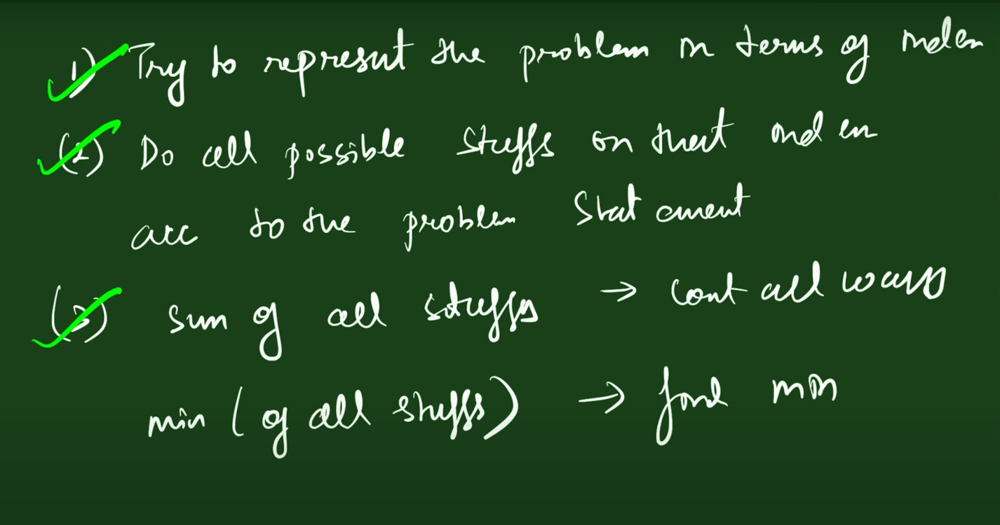

TABULATION-

BOTTOM UP

MEMORIIZATION- TOP DOWN

---

SPACE OPTIMIZATION

types to understand

total no of ways, minimum ways,maximum ways for dp

best ways or count all ways to determine for recursion

---

PROBLEMS

1.
2. FIBONACI SERIES
3.
